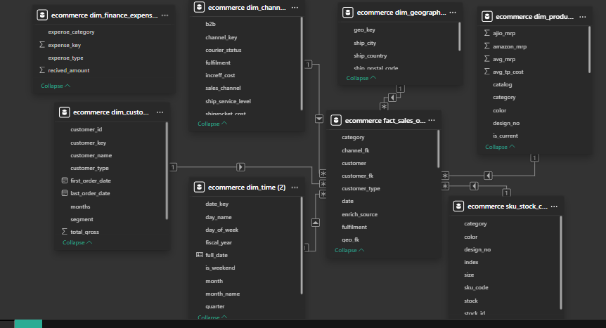

# E-Commerce Sales Analytics | ₹347M Revenue Deep Dive (91-Day Indian Fashion Dataset)

**End-to-End SQL Data Modeling & Business Intelligence Project**(Please project report)
540,716 order lines • 72,826 orders • 1,330 SKUs • Multi-channel pricing intelligence (Amazon, Ajio, Myntra, Flipkart)  
March – June 2022

## 🚀 Project Objective
Transform raw operational CSVs into a fully normalized **star schema** using MySQL and deliver actionable insights & recommendations that can drive **10–15% revenue uplift** through:
- Customer concentration risk mitigation
- Inventory optimization (6.3% stockout rate)
- Promotional ROI improvement
- Pricing strategy refinement across marketplaces

## 🛠️ Tools & Technologies
- **MySQL** – Complete ETL, normalization, surrogate keys, complex CTEs, window functions, statistical aggregations
- **Python (pandas)** – Initial data profiling & preparation of raw CSVs
- **Excel / Google Sheets** – Final reporting & visualizations (optional)

## 📊 Key Business Insights & Findings
| Area                        | Highlight                                                                 | Recommendation / Opportunity                  |
|-----------------------------|---------------------------------------------------------------------------|-----------------------------------------------|
| Revenue & Profitability     | ₹347.2M revenue • 75%+ average gross margin                               | Strong pricing power                          |
| Order Metrics               | AOV ₹642 • Avg. 7.4 items per order                                      | Excellent basket size                         |
| Customer Concentration      | Top 10 customers = 51.65% revenue • Top 30% customers ≈ 80% revenue (Pareto) | High dependency risk – diversify customer base|
| Product Portfolio           | Kurta (61.6% SKUs), Sets (27%), Tops dominate • Tops highest margin (79.8%) | Focus inventory & marketing on high-margin categories |
| Pricing Strategy            | Consistent pricing across Amazon/Ajio/Myntra/Flipkart (~₹2,240 avg MRP)   | Stable competitive positioning                |
| Promotions                  | 59% orders promotional • Free Shipping drives 61% of promo revenue      | Double down on free-shipping thresholds      |
| Inventory Health            | 6.3% stockout rate • 49% SKUs critically low (1–10 units)                | Urgent restock prioritization needed          |
| Expenses                    | Lean operational costs across logistics, packaging, travel, etc.        | Maintain cost discipline                      |

## 🔧 Data Modeling – From Raw CSVs to Star Schema
Converted 8 messy operational tables into a clean, scalable **star schema**:

### Dimension Tables
- `dim_customer`
- `dim_channel`
- `dim_geography`
- `dim_product` (merged pricing from multiple platforms + inventory levels)
- `dim_time` (full fiscal calendar with year, quarter, month, weekend flags)
- `dim_finance_expenses`

### Fact Table
- `fact_sales_orders` (540,716 granular order lines with customer aggregations)

### Supplementary Table
- `sku_stock_clean` (kept separate for inventory-specific analysis)

→ Full **ERD included**

  

## 🧪 Advanced Analytical Techniques Applied
- Pareto & customer concentration analysis
- ABC inventory classification (by value & volume)
- Stockout risk segmentation (zero stock, critical low)
- Promotional vs non-promotional performance
- Margin analysis by price tier (Premium vs Luxury)
- Style & catalog diversity metrics
- Statistical measures (mean, median, percentiles, standard deviation)

## 📁 Repository Structure
├── archieve/                  # Raw & processed CSVs (optional – respect Kaggle license)
├── sql/
├── docs/                   #project report
├── image/                # ERD + key charts
└── README.md

## 🎯 Why This Project Stands Out for Data Analysts
- Real-world messy dataset → production-ready normalized schema
- Heavy SQL usage: CTEs, window functions, surrogate keys, statistical aggregations
- Clear translation of raw numbers into executive-level recommendations
- Focus on high-impact e-commerce KPIs (AOV, margin, stockouts, customer concentration)

Perfect addition to any data analyst / business analyst portfolio targeting retail, e-commerce, or fashion analytics roles.

⭐ Star the repo if you found it useful!  
Feedback welcome — always iterating.

🔗 LinkedIn: linkedin.com/in/abu-sufian-data | More projects: [will come soon]

